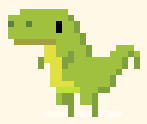
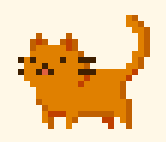
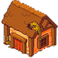
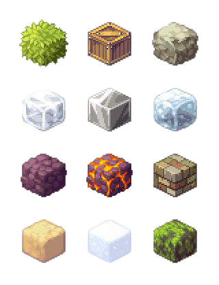
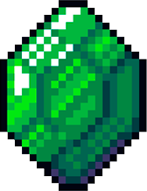

[🇬🇧 English](README.md)

# **Dinosaur Settlement**

## Цель создания
Учебный проект, выполненный в рамках обучения в Лицее Академии Яндекса. Наш первый опыт создания игры на Pygame.

## **Об игре**
Игра о милом динозавре, который живет на острове с котом.

### **Цель игры**
Заработать определенную сумму монет, для перехода на новый уровень и в последствии завершения игры

### **Когда завершается игра**
Игра завершается, когда на последнем уровне достигается нужное количество монет

### **Способы заработка монет**
* Сбор кристаллов 
* Разрушение предметов
* Покупка домов, которые зарабатывают монетки
* Выполнение заданий от кота

## **Персонажи**
Данным персонажем придется управлять вам, только в зависимости от острова он будет менять цвет и одежду

А это тот самый кот, о котором мы говорили ранее 
(кстати это наш преподаватель и поэтому котика зовут Еленой)

## **Объекты**
Пример домика

А это блоки, из которых строяся наши острова

А это один из видов кристаллика

## **Первое использование** 
После того как вы скачаете себе проект запустите команду `pip install -r requirements.txt`
Она поможет вам добавить все нужные библиотеки
## **Контакты**
**Телеграмм** @DinPg

**Почта** andreiduvakin@gmail.com

## Лицензия
MIT. См. файл [LICENSE](LICENSE).
